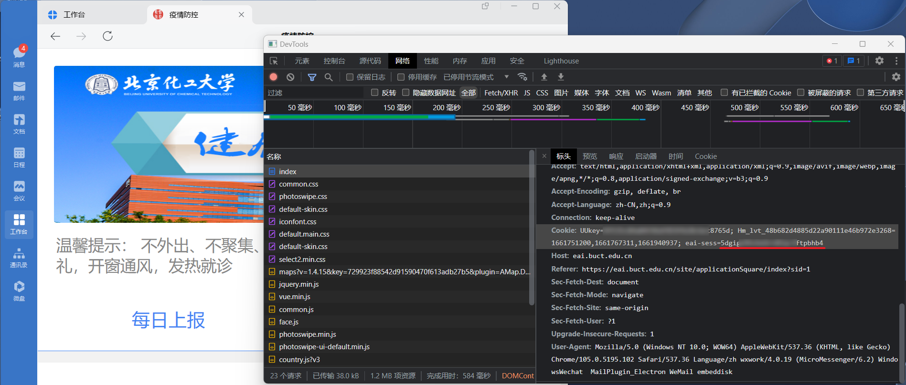

# BUCT_COVID-19_Report

基于 Python3 的适用于北京化工大学的 COVID-19 自动填报脚本  

项目用于学习交流，仅用于各项无异常时打卡，如有身体不适等情况还请自行如实打卡

## 使用方式

1. 打开企业微信，按`Ctrl+Alt+Shift+D`组合键进入调试模式。进入“返校打卡”页面，右键单击，在DevTools“网络”页面获得`cookies`中`eai-sess`项的值

2. 修改 `report.py` 内的经纬度（可选)  

## 自动化
### Linux/OpenWRT

```shell script
crontab -e
```

每天晚上18点01分上报并追加输出到日志

```shell script
1 18 * * * python ~/scripts/home_buctrp.py >> report.log
```
